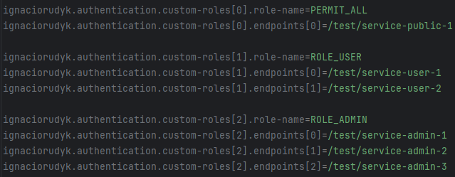

# Ignaciorudyk-starter-authentication — JWT Auth API

API REST de autenticación stateless con Spring Security 6, JWT, y roles. Proyecto de portfolio orientado a implementación real en producción.

## Stack

| Tecnología | Versión | Uso |
|---|---|---|
| Java | 21 | Lenguaje principal |
| Spring Boot | 3.3 | Framework base |
| Spring Security | 6 | Autenticación y autorización |
| PostgreSQL | 16 | Base de datos |
| Flyway | 10 | Migraciones de schema |
| jjwt | 0.12 | Generación/validación JWT |

## Arquitectura

```
POST /auth/register  →  Registro de nuevo usuario
POST /auth/login     →  Login, devuelve Access + Refresh Token
POST /auth/refresh   →  Rota el Refresh Token, devuelve nuevo Access Token
POST /auth/logout    →  Revoca el Refresh Token activo

PATCH  /users/me         → Actualiza los datos personales del usuario [ROLE_USER]
PATCH  /users/admin/{id} → Actualiza los datos de un usuario [ROLE_ADMIN]
DELETE /users/admin/{id} → Elimina el usuario del sistema
```

## Flujo de autenticación

```
Cliente                API
  |                     |
  |-- POST /login -->   |
  |                     | valida credenciales
  |                     | genera Access Token
  |                     | genera Refresh Token
  |<-- 200 tokens ---   |
  |                     |
  |-- GET /users/me --> | (con Access Token en header)
  |   Authorization:    |
  |   Bearer <token>    | valida JWT (sin hit a DB)
  |<-- 200 user -----   |
  |                     |
  |-- POST /refresh->   | (cuando Access Token expira)
  |                     | valida Refresh Token en DB
  |                     | revoca token viejo (rotación)
  |                     | genera nuevo par de tokens
  |<-- 200 tokens ---   |
```

## Seguridad implementada

- Contraseñas hasheadas con **BCrypt** (strength 10)
- **Access Token** de vida corta 15 min (configurable) — stateless, validado sin DB
- **Refresh Token** de vida larga 7 días (configurable) — guardado en DB, permite revocación real
- **Token rotation** — al hacer refresh, el token viejo se invalida
- **Logout real** — revoca el Refresh Token en DB
- Headers de seguridad HTTP configurados vía Spring Security
- Validación de inputs con Bean Validation

## Cómo correr localmente

### Requisitos
Tener instalado JDK 21, GIT, Maven y Postgres.

Descargar el proyecto:

`git clone https://github.com/ignacio-rudyk/ignaciorudyk-starter-auth`

En una terminal dirigirse a la raiz del proyecto e instalar la dependencia en el repositorio local:

`mvn clean install`

Luego crear un proyecto Spring Boot que será el consumidor de la dependencia. 

En el nuevo proyecto agregar la siguiente dependencia al pom.xml:

```
<dependency>
    <groupId>com.ignaciorudyk.auth</groupId>
    <artifactId>ignaciorudyk-starter-auth</artifactId>
    <version>1.0.0</version>
</dependency>
```

Crear una base de datos en Postgres para utilizar en el proyecto.

## Configuración

El starter permite definir los endpoints y sus reglas de acceso desde la configuración de la aplicación.

### Ejemplo de configuracion de roles y endpoints



### Propiedades configurables en el proyecto consumidor

En el archivo application.properties agregue si es necesario las siguientes properties:

| Propiedad                                                        | Descripción                                                                                  | Obligatorio |
|------------------------------------------------------------------|----------------------------------------------------------------------------------------------|-------------|
| ignaciorudyk.authentication.enabled                              | Habilita o deshabilita la dependencia (por defecto es true).                                 | No          |
| ignaciorudyk.authentication.secret-key                           | Establece un secret key.                                                                     | Sí          |
| ignaciorudyk.authentication.access-token-expiration              | Establece el access token expiration en MS.                                                  | No          |
| ignaciorudyk.authentication.refresh-token-expiration             | Establece el refresh token expiration en MS.                                                 | No          |
| spring.datasource.url                                            | Establece la url de la base de datos.                                                        | Sí          |
| spring.datasource.username                                       | Establece el usuario de la base de datos.                                                    | Sí          |
| spring.datasource.password                                       | Establece la contraseña de la base de datos.                                                 | Sí          |
| spring.datasource.driver-class-name                              | Establece driver JDBC .                                                                      | Sí          |
| spring.jpa.properties.hibernate.dialect                          | Establece qué tipo de SQL generar para la base de datos.                                     | Sí          |
| spring.flyway.enabled                                            | Habilita o deshabilita la dependencia de Flyway.                                             | No          |
| spring.flyway.locations                                          | Establece la ruta dónde debe buscar Flyway los scripts SQL de migración.                     | Sí          |
| spring.flyway.baseline-on-migrate                                | Toma la instancia de la base de datos que fue creada sin flyway como punto inicial.(boolean) | No          |
| springdoc.api-docs.path                                          | Cambia la URL donde Springdoc expone el documento OpenAPI en formato JSON.                   | No          |
| springdoc.swagger-ui.path                                        | Permite cambiar la URL donde se muestra la interfaz de Swagger UI.                           | No          |
| springdoc.swagger-ui.tags-sorter                                 | Define cómo se ordenan los tags en Swagger UI.                                               | No          |
| ignaciorudyk.authentication.custom-roles[index].role-name        | Configure un endpoint.                                                                       | No          |
| ignaciorudyk.authentication.custom-roles[index].endpoints[index] | Configure una ruta.                                                                          | No          |
| ignaciorudyk.authentication.allowed-origins[index]               | Configure qué dominios pueden consumir tu API.                                               | No          |
| ignaciorudyk.authentication.allowed-methods[index]               | Configure qué métodos HTTP están permitidos desde otros orígenes.                            | No          |
| ignaciorudyk.authentication.allowed-headers[index]               | Configure qué encabezados (headers) puede enviar el navegador al backend.                    | No          |
| ignaciorudyk.authentication.exposed-headers[index]               | Configure qué headers de la respuesta el navegador puede leer desde JavaScript.              | No          |

Para algunas de las propiedades anteriores configurar las siguientes variables de entorno:

```
┌── DB_HOST -> spring.datasource.url
├── DB_PORT -> spring.datasource.url
├── DB_NAME -> spring.datasource.url
├── DB_USER -> spring.datasource.username
├── DB_PASSWORD -> spring.datasource.password
├── JWT_SECRET -> ignaciorudyk.authentication.secret-key
├── JWT_ACCESS_TOKEN_EXPIRATION -> ignaciorudyk.authentication.access-token-expiration
└── JWT_REFRESH_TOKEN_EXPIRATION -> ignaciorudyk.authentication.refresh-token-expiration
```

En una terminal dirigirse a la carpeta raiz del proyecto consumidor y ejecutar:

`mvn clean package`

Luego dirigirse a la carpeta `target` y ejecutar el .jar contenido con el siguiente comando:

`java -jar mi-app.jar`.

La API queda disponible en `http://localhost:8080`  
Swagger UI: `http://localhost:8080/swagger-ui.html`

## Estructura del proyecto

```
src/main/
├── java/com/ignaciorudyk/
│   └── auth/
│       ├── autoconfigure/
│       │   └── AuthAutoConfiguration.java
│       │
│       ├── config/
│       │   ├── security/
│       │   │   ├── SecurityAutoConfiguration.java
│       │   │   ├── SecurityCustomizer.java
│       │   │   └── SecurityFilterChainAutoConfiguration.java
│       │   ├── ApplicationConfig.java
│       │   ├── JwtAuthenticationFilter.java
│       │   ├── OpenApiConfig.java
│       │   └── StarterAuthenticationProperties.java
│       │
│       ├── controller/
│       │   ├── AuthController.java
│       │   └── UserController.java
│       │
│       ├── dto/
│       │   ├── request/
│       │   │   ├── LoginRequestDTO.java
│       │   │   ├── RefreshTokenRequestDTO.java
│       │   │   ├── RegisterRequestDTO.java
│       │   │   ├── UpdateMeRequest.java
│       │   │   └── UpdateUserRequest.java
│       │   └── response/
│       │       ├── base/
│       │       │   ├── ErrorDTO.java
│       │       │   ├── MetadataDTO.java
│       │       │   └── ResponseDTO.java
│       │       ├── AuthResponseDTO.java
│       │       └── UserInfoDTO.java
│       │
│       ├── exception/
│       │   ├── handler/
│       │   │   ├── GlobalExceptionHandler.java
│       │   │   ├── JwtAccessDeniedHandler.java
│       │   │   └── JwtAuthEntryPointHandler.java
│       │   ├── AuthenticationException.java
│       │   ├── EmailAlreadyExistsException.java
│       │   └── InvalidTokenException.java
│       │
│       ├── mapper/
│       │   └── UserMapper.java
│       │
│       ├── model/
│       │   ├── RefreshToken.java
│       │   ├── Role.java
│       │   └── User.java
│       │
│       ├── repository/
│       │   ├── RefreshTokenRepository.java
│       │   └── UserRepository.java
│       │
│       ├── service/
│       │   ├── implementation/
│       │   │   ├── AuthServiceImpl.java
│       │   │   ├── JwtServiceImpl.java
│       │   │   └── UserServiceImpl.java
│       │   ├── AuthService.java
│       │   ├── JwtService.java
│       │   └── UserService.java
│       │
│       └── util/
│           └── HttpUtil.java
│
└── resources/
    ├── db/
    │   └── migration/
    │       └── V1__init_schema.sql
    ├── META-INF/
    │   └── spring/
    │       └── org.springframework.boot.autoconfigure.AutoConfiguration.imports
    └── application.properties
```

## Decisiones de diseño

**¿Por qué JWT stateless?**  
Los Access Tokens se validan sin consultar la DB en cada request. Escala horizontalmente sin necesidad de sesiones compartidas (Redis, etc.).

**¿Por qué Refresh Token en DB?**  
Permite logout real y rotación. Un Access Token expirado no sirve; un Refresh Token revocado no puede obtener nuevos tokens.

**¿Por qué Flyway?**  
Los cambios de schema son código, están versionados, y son reproducibles en cualquier entorno.
